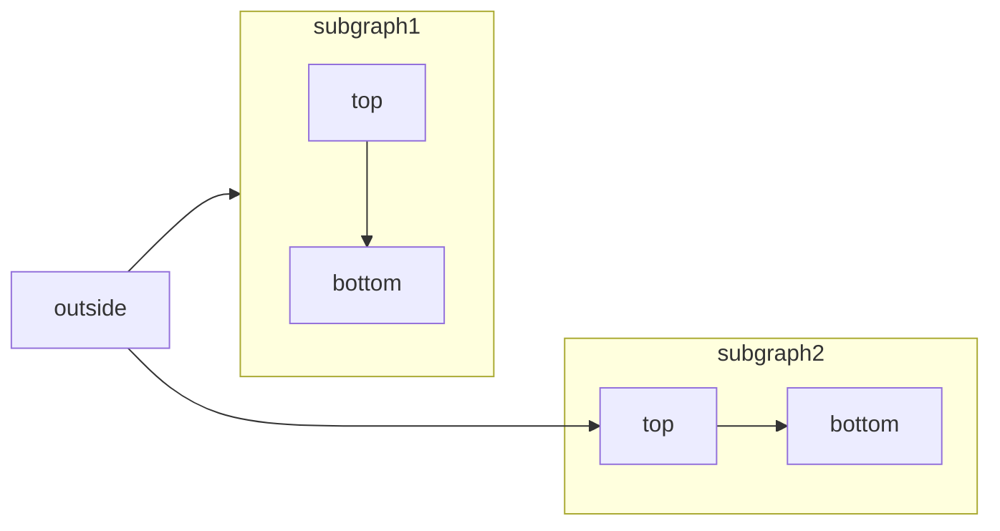

<Accordion title="I am an Accordion.">
  You can put any content in here.
</Accordion>

<AccordionGroup>
  <Accordion title="FAQ without Icon">
    You can put other components inside Accordions.

    ```java HelloWorld.java
    class HelloWorld {
        public static void main(String[] args) {
            System.out.println("Hello, World!");
        }
    }
    ```

  </Accordion>

  <Accordion title="FAQ with Icon" icon="alien-8bit">
    Check out the [Accordion](/content/components/accordions) docs for all the supported props.
  </Accordion>

  <Accordion title="FAQ without Icon">
    Check out the [Accordion](/content/components/accordions) docs for all the supported props.
  </Accordion>
</AccordionGroup>

<Note>This adds a note in the content</Note>

<Warning>This raises a warning to watch out for</Warning>

<Info>This draws attention to important information</Info>

<Tip>This suggests a helpful tip</Tip>

<Check>This brings us a checked status</Check>

<Card title="Click on me" icon="link" href="/content/components/card-group">
  This is how you use a card with an icon and a link. Clicking on this card
  brings you to the Card Group page.
</Card>


<CardGroup cols={2}>
  <Card title="First Card" icon="square-1">
    Neque porro quisquam est qui dolorem ipsum quia dolor sit amet
  </Card>
  <Card title="Second Card" icon="square-2">
    Lorem ipsum dolor sit amet, consectetur adipiscing elit
  </Card>
  <Card title="Third Card" icon="square-3">
    Ut enim ad minim veniam, quis nostrud exercitation ullamco
  </Card>
  <Card title="Fourth Card" icon="square-4">
    Excepteur sint occaecat cupidatat non proident
  </Card>
</CardGroup>

<Frame>
  
</Frame>

<Icon icon="check" size={32} />



<Steps>
  <Step title="First Step">
    These are instructions or content that only pertain to the first step.
  </Step>
  <Step title="Second Step">
    These are instructions or content that only pertain to the second step.
  </Step>
  <Step title="Third Step">
    These are instructions or content that only pertain to the third step.
  </Step>
</Steps>

<Tabs>
  <Tab title="First Tab">
    ☝️ Welcome to the content that you can only see inside the first Tab.
  </Tab>
  <Tab title="Second Tab">
    ✌️ Here's content that's only inside the second Tab.
  </Tab>
  <Tab title="Third Tab">
    💪 Here's content that's only inside the third Tab.
  </Tab>
</Tabs>

<Tooltip tip="This is a tooltip!">Hover over me</Tooltip> and a tooltip in action

